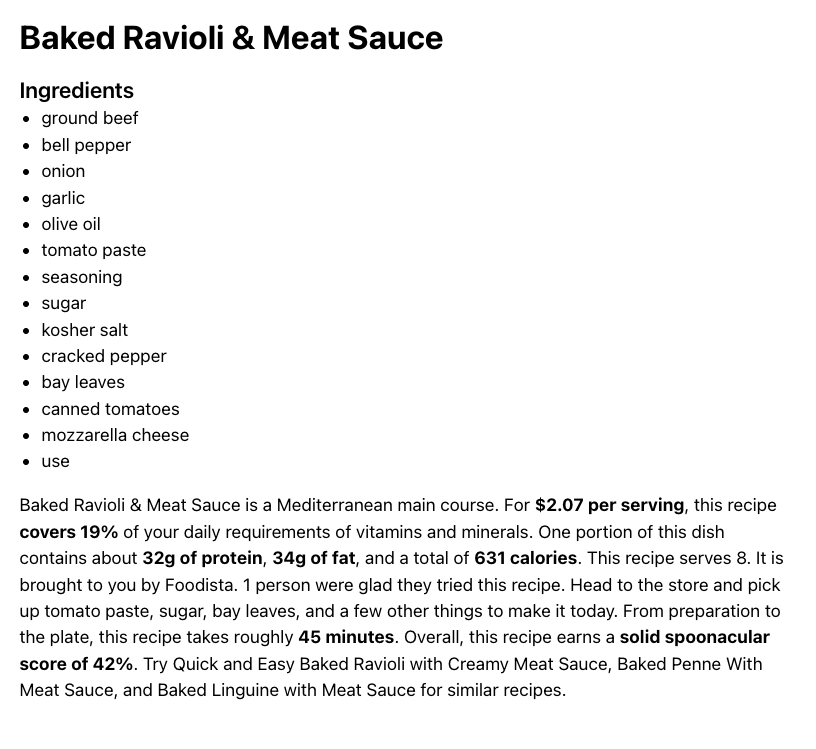

# Recipe Finder App

A **Next.js** app to search, filter, and view recipe details using the Spoonacular API.




## Features

- Search recipes by name, cuisine, and prep time
- View recipe details (ingredients, summary)
- Skeleton loaders for smooth UX
- Caching (1 min) for performance
- Error handling for failed API requests
- Fully responsive design

## Tech Stack

- **Next.js 15 (App Router)**
- **Tailwind CSS** for styling
- **Axios with caching** for API calls
- **React Suspense** for async loading

## Setup

```bash
git clone git@github.com:GEOFARL/recipe-finder.git
cd recipe-finder
npm install
cp .env.local.example .env.local
# enter you api key
npm run dev
```
